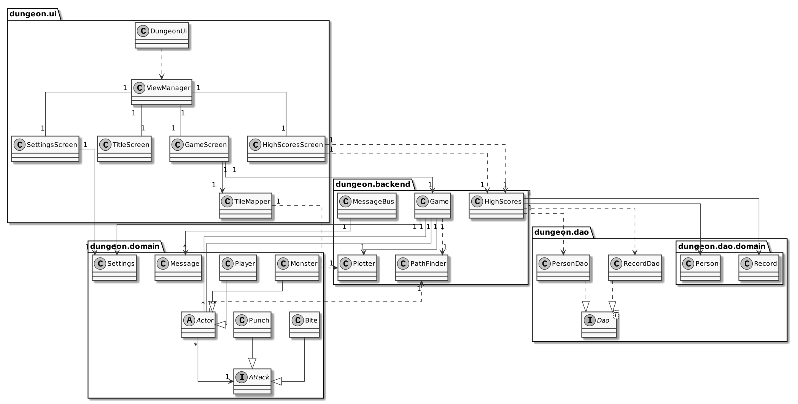
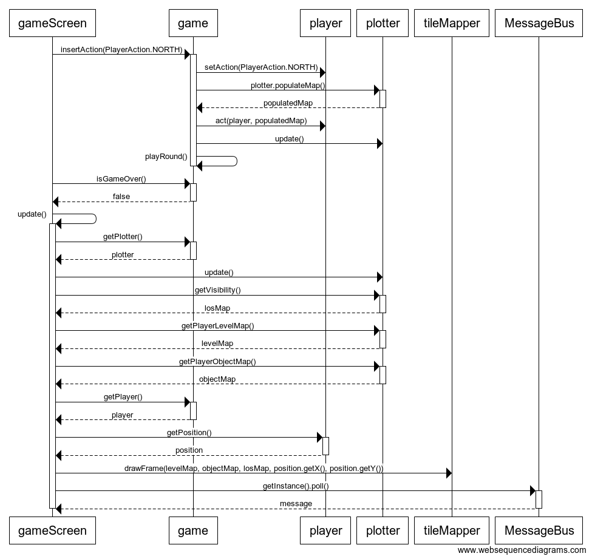
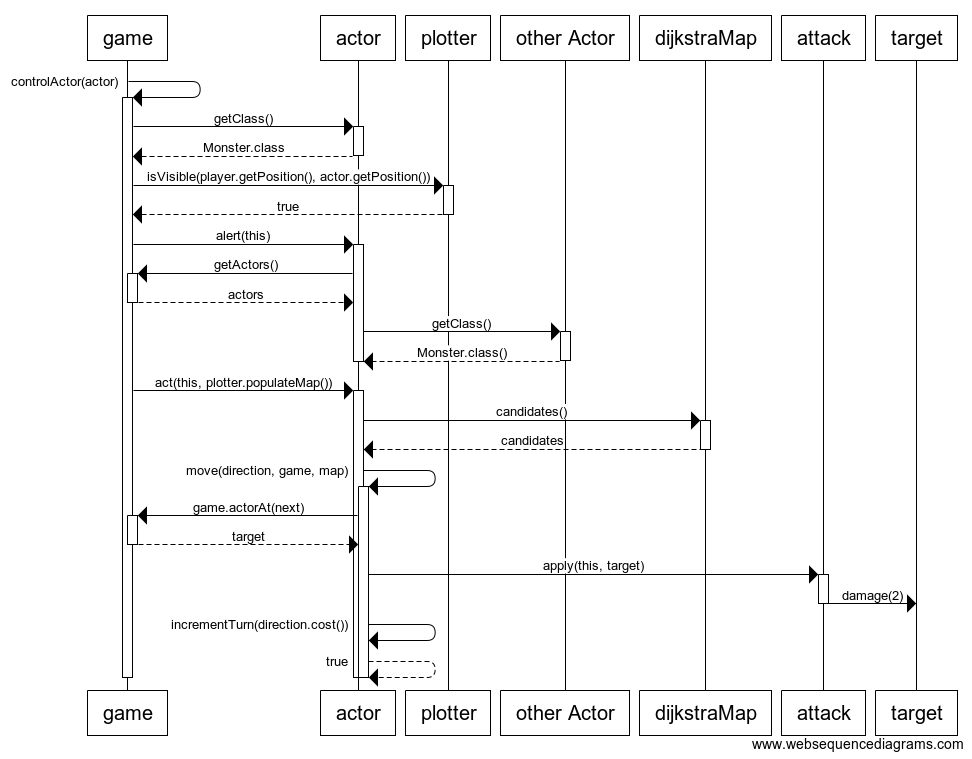

# Arkkitehtuurikuvaus
## Rakenne
Ohjelmassa on kerrosarkkitehtuuri, joka koostuu neljästä pakkauksesta kolmessa tasossa.

Pakkaus dungeon.ui sisältää sovelluksen käyttöliittymän, dungeon.backend sovelluslogiikan, dungeon.domain sovelluksen käyttämät apuluokat ja dao tiedon pysyväistallennuksesta vastavat luokat.

## Käyttöliittymä
Sovelluksessa on viisi erilaista näkymää:  
- alkuruutu
- peliparametrien valinta
- peliruutu
    - jos pelaaja on saanut korkean pistemäärän, niin peli kysyy pelaajan nimeä
- pistetilastot.
Näkymiä hallinnoi Stage-olion muuttujana sisältävä ViewManager-olio, jota luokat ohjaavat näkymästä toiseen siirryttäessä. DungeonUi luo viewMnager-olion ja kutsuu sen showTitleScreen()-metodin. ShowTitleScreen() luo uuden TitleScreen-olion, joka asettaa sovelluksen stagen aloitusruuduksi. Aloitusruudun valinnat on määritetty ajamaan ViewManagerin muita metodeja.
Pelin logiikka ja kartanpiirtokoodi on pyritty toteuttamaan siten, että sovelluksen voi toteuttaa muillakin rajapinnoilla tai käyttöliittymätyypeillä tarvittaessa. Muut käyttöliittymäluokat eivät ole olennaisia pelin kannalta. Sovelluksen logiikka ja käyttöliittymä on siis eriytetty toisistaan.
GameScreen luo Game-olion ja Game-olion riippuvuuksien piirtämiä karttoja visualisoivan TileMapper-olion. TileMapper-olio päivittää GameScreenin Canvas-olion pelinäkymän sille annettujen parametrien mukaisesti. Odotetun napinpainalluksen yhteydessä GameScreen syöttää Game-olioon Player-oliolle välitettävän käskyn insertAction-metodilla, minkä yhteydessä peli ajaa pelikierroksen. Jos peli loppuu kierroksen aikana, niin pelaajaa estetään syöttämästä lisää komentoja. Pelistä noudetaan uusi karttatila, ja kartat annetaan TileMapperille piirrettäviksi. Tämän jälkeen päivitetään pelaajan tilaa kuvaava teksti ja noudetaan ja tulostetaan TextArea-oliossa MessageBus-yksiön jonoon päätyneet viestit.

## Sovelluslogiikka
Sovelluksessa olennaisimmat luokat ovat Game ja abstrakti luokka Actor. Actor-luokan aliluokat kuvaavat itsenäisiä toimijoita pelin kartalla. GameScreen-luokka syöttää käskyn pelaajahahmolle insertAction()-metodilla, jossa pelaajan seuraava toiminto määritetään ja toteutetaan käännöksellä Actor-luokan suuntakäskyksi.
insertAction()-metodin lopussa peli käy playRound()-metodissa läpi yhden kierroksen prioriteettijonolla toimivassa vuorojärjestelmässä kutsuen controlActor()-metodin jokaiselle Actor-oliolle, jonka terveyspisteet eivät ole vielä laskeneet nollaan ja palauttaen tämän jonoon tämän vuoron päätyttyä. Jos Actor-olio on Player-luokkaa, niin jonon läpikäyminen keskeytetään ja pelin suorittamisvuoro palaa GameScreen-luokalle kunnes seuraava syöte annetaan.

Jos Actor-olio on kuollut, niin se poistetaan mm. kartan piirtämiseen käytetystä Actor-olioiden listasta Actors, eikä sitä palauteta jonoon. Jos kuollut olio on pelaaja, niin ajetaan endGame()-metodi, joka asettaa gameOver-totuusarvon, joka estää peliä etenemästä.

## Toimintalogiikka
Osia sekvenssikaaviosta on jätetty pois, sillä ne ovat epäolennaisia ohjelman kriittisen toiminnan kannalta ja vievät liikaa tilaa.

### Pelaaja syöttää komennon.
Kun pelaaja painaa näppäintä, jolle on määritetty toiminto, sovelluksen kontrolli etenee seuraavasti.

Näppäimille on määritetty vastaavuudet staattisessa HashMap-oliossa legalKeyCodes. Sovellus kutsuu Game-luokan insertAction()-metodia, jolla syötetään pelaajahahmon komento pelisilmukkaan. Tämän jälkeen peli päivittää näkyvyyden ja suorittaa yhden pelikierroksen.

GameScreen tarkistaa, onko peli loppu, hakee päivittää pelikartan ja hakee päivitetyt karttatiedot ja viitteen pelaajahahmoon. Karttatiedot ja pelaajan sijainti välitetään tileMapper-oliolle, joka piirtää karttanäkymän GameScreenin siihen konstruktorissa injektoimalla GraphicsContext-oliolla, joka on luotu stageen sijoitetusta Canvas-oliosta.

Tämän jälkeen GameScreen-olio tyhjentää MessageBus-olion viestijonon ikkunan alalaidassa olevaan TextArea-elementtiin.

### Hirviö huomaa lähellä olevan pelaajan ja hyökkää.
Pelaajan syötteen ajamisen jälkeen ajetaan tietokoneen hallitsemia hahmoja ohjaava metodi controlActor. Kaikki hahmot (actor) listassa käydään läpi, ja jos jokin on hirviö, niin tarkistetaan onko se pelaajan näkökentässä. reactOnSight-metodissa tarkistetaan, onko pelaaja hirviön näön kantaman sisällä.

Jos hirviö näkee pelaajan, niin se nostaa hälytyksen. alert-metodissa lasketaan PathFinder-olion avulla hyökkäysreittin päättelyyn tarvittava Dijkstra-kartta. Jos hirviö on pakotilassa, niin Dijkstra-kartta käännetään tämän hirviön kohdalle. Hirviö varoittaa lähistöllä olevia ja asettaa näiden Dijkstra-kartan aiemmin lasketuksi hyökkäyskartaksi ja tilan hyökkäystilaksi.

Tämän jälkeen hirviö toimii tilansa mukaisesti ja seuraa Dijkstra-karttaa. Tässä tapauksessa pelaaja on kartan mukaan parhaan naapuriruudun kohdalla, joten perityn Actor-luokan move-metodissa kutsutaan hyökkäyksen Attack apply-metodia, joka välittää vahingon kohteeseen Actor-luokan damage-metodilla.

Tämän jälkeen hirviön vuoroarvoa kasvatetaan ja liikkeestä palautetaan totuusarvo true, joka merkitsee, että liike on onnistunut. Tämä pysäyttää suuntavaihtoehtojen läpikäynnin.

# Rakenteelliset heikkoudet
### backend-luokat
Actor-luokan aliluokkien toiminta on liian erillistä. Kannattaisi toteuttaa tekoäly erillisessä luokassa ja tehdä käyttäjän ohjaamasta pelaajahahmosta tekoälyn erityistapaus. Tämä tekisi autoexploren toteuttamisesta Dijkstra-kartoilla suoraviivaista.

### testikattavuus
Sovelluksen testit voivat jäädä haarakattavuuden kannalta vajaiksi, sillä ohjelmalogiikassa on paljon riippuvuusinjektiota, joka vaikeuttavat kattavaa testaamista. Pelitila on liian monimutkainen.

### koodin laatu
Käyttöliittymäluokissa on jonkin verran toisteista koodia, ja tarpeettomiksi käyneitä metodia ja muuttujia on jäänyt koodiin paljon.
