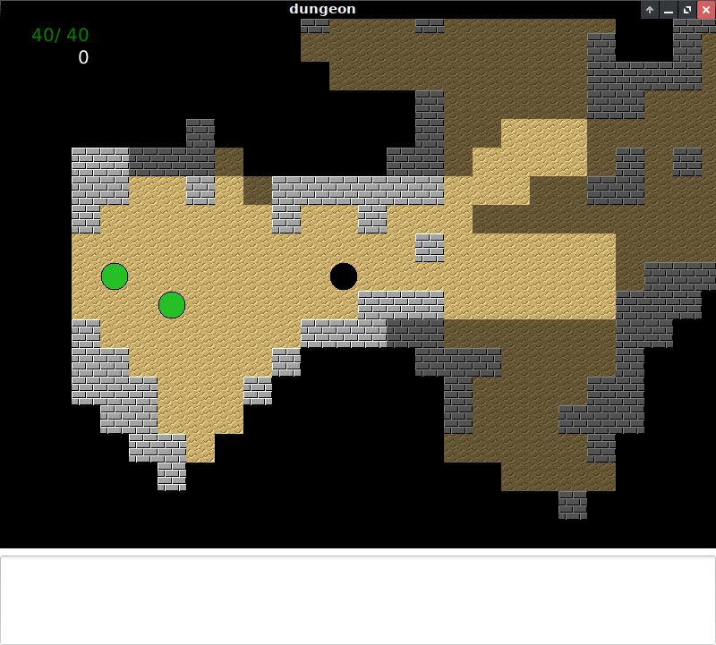

### Ohjeet
Pelin alussa on mahdollista valita vaikeusaste ja karttakoko. Vaikeusaste vaikuttaa hirviöiden yleiseen esiintymistiheyteen kartalla ja eri hirviötyyppien esiintymisen todennäköisyyksiin. Karttakokoa valittaessa on hyvä huomioida, että suurella kartalla on kaikkiaan enemmän hirviöitä, joita voi kertyä pakomatkan varrella.

Pelissä liikutaan nuolinäppäimillä tai H-, J-, K- ja L-näppäimillä. H-näppäin siirtää pelihahmoa länteen, J-näppäin etelään, K-näppäin pohjoiseen ja L-näppäin itään. Pelihahmoa voi myös liikkua luoteeseen Y-näppäimellä, koilliseen U-näppäimellä, lounaaseen N-näppäimellä ja kaakkoon M-näppäimellä. Myös hirviöt voivat liikkua väli-ilmansuuntiin, joten on suositeltavaa opetella käyttämään HJKL-näppäimiä. .-näppäin pitää pelaajaa paikallaan. Tämä on hyödyllistä turvapaikoissa pysyttäessä.

Pelialueesta näkyy vain pelihahmon näkökenttään kuuluvat alueet. Aiemmin nähdyt alueet sisältöineen näkyvät varjostettuina. Pelaajan terveyspisteet näkyvät ruudun vasemmassa yläkulmassa.

Hirviöt osaavat hakeutua pelaajan lähelle minkä tahansa esteiden ympäri niin kauan kuin reitti pelaajan lähelle on olemassa. Hirviöt ovat kuitenkin tietoisia vain pelaajan viimeisimmästä sijainnista eivätkä näe pelaajaa aivan tämän näkökentän rajalla, joten etene varovaisesti. Hirviöt osaavat nostaa hälytyksen nähdessään pelaajan, jolloin muut hirviöt hälytyksen säteellä alkavat hakeutumaan pelaajan viimeisintä havaittua sijaintia kohti.

Hyökkääminen tapahtuu painamalla suuntanäppäintä kohteen suuntaan silloin, kun pelaajahahmo on sen vierellä.

Toistaiseksi hirviöitä ei ole ohjelmoitu liikkumaan muulloin kuin niiden hyökätessä tai paetessa, joten paikat, joissa yksikään näkyvä ruutu ei ole minkään uhan reitillä ovat aina turvallisia.

Hirviöitä on toistaiseksi kolmenlaisia:

### Örkki

Heikoin hirviö. Pakenee parin osuman jälkeen eikä kovin tehokkaasti.

### Ihmishyeena

Jonkin verran vahvempi kuin örkki. Taistelee itsetuhoisen aggressiivisesti.

### Lohikäärme

Vahvin hirviö. Ei nosta hälytystä eikä reagoi muiden hirviöiden hälytyksiin. Osaa paeta suhteellisen älykkäästi.
