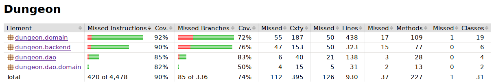

# Testausdokumentti
Ohjelman testit ovat muuttuneet kehityksen aikana. Testeistä yksikkötestejä sisältävät lähinnä pohjaluokat, joista muut riippuvat. Loput testit ovat integraatiotestejä, sillä projektin aikataulun puitteissa ei ole ollut mahdollista kirjoittaa korvaavia valeluokkia kaikille riippuvuuksille. Sovelluksen käyttökokemusta on paranneltu manuaalisella testauksella.
Käyttöliittymäluokat on jätetty testauksen ulkopuolelle.

## Yksikkö- ja integraatiotestaus
### Logiikka
Sovelluksen logiikkaa on testattu integraatiotesteillä, joissa dungeon.backend- ja dungeon.domain -pakkausten sisältämiä luokkia on testattu sovelluksen normaalien toimintaperiaatteiden mukaisesti. Testauksessa on priorisoitu sovelluksen toiminnan kannalta merkityksellistä ja helposti rikkoutuvaa toiminnallisuutta. Integraatiotesteissä käytetään aiemmin yksikkötestattuja luokkia.

### DAO
Valtaosa DAO-luokkien testeistä kirjoitettiin silloin, kun DAO-osuus oli erillisessä testiprojektissa. DAO-luokat käyttävät testitietokantaa Dungeon/savedGames/TestDatabase. Testit käsittelevät sovelluksen normaalia toimintaa.

### Apuluokat (domain)
Domain-luokat riippuvat osin logiikkaluokista, joten perustoiminnallisuuden valmistuttua alustavien yksikkötestien avulla testit on muutettu integraatiotesteiksi aitojen luokkien kanssa.

### Testauskattavuus
Sovelluksessa testattujen pakkausten testien rivikattavuus on 90% ja haarautumakattavuus 74%. Kaikelle ei ehditty kirjoittaa testejä.

## Järjestelmätestaus
Sovelluksesta on suoritettu manuaalinen järjestelmätestaus.

### Asennus ja konfigurointi
Sovellus on haettu ja sitä on testattu kahdessa eri Linux-ympäristössä.

Testauksessa on oletettu, että sovelluksen käynnistyshakemisto on juurihakemisto, jossa sijaitsee savedGames-hakemisto ja tiedosto resources/tileset.png. Sovellusta on myös testattu tilanteessa, jossa hakemistot eivät ole saatavilla. Tiedostoista hakemisto savedData tietokantoineen luodaan automaattisesti pistetilastoja avattaessa.

### Toiminnallisuudet
Määrittelydokumentin toiminnallisuudet on käyty läpi käyttämällä sovellusta. Rajatapauksia on pyritty testaamaan kattavasti.

# Laatuongelmat
- Sovellus ei toistaiseksi kieltäydy aloittamasta peliä tiedoston tileset.png puuttuessa. Tässä tilanteessa peliruutuun ei piirry muuta kuin pelaajahahmon näkökenttä.
- Joitakin luokkia ei ole testattu suorasti ollenkaan. Tämä johtuu siitä, että ne ovat apuluokkia, joiden testaus ei ole ollut olennaista yksinkertaisuuden vuoksi.
- Toisia luokkia ei ole testattu lainkaan.
- Joitakin metodeja ei käytetä sovelluksen normaalissa toiminnassa mutta ne ovat tarpeellisia testauksen kannalta.
