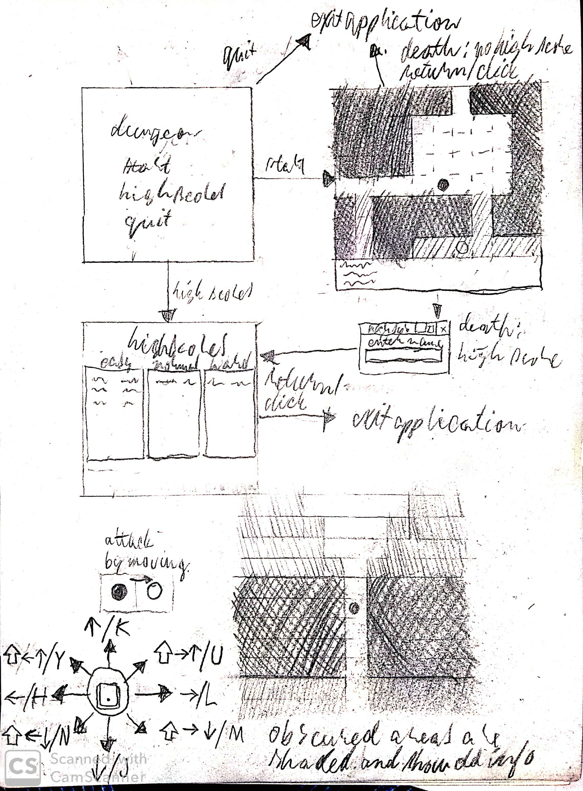

# Vaatimusmäärittely
## Sovelluksen tarkoitus
Sovellus toteuttaa yksinkertaisen luolapelin. Luolapeli pitää myös kirjaa pelaajien menestyksestä.
## Käyttäjät
Sovelluksessa on kaksi käyttäjäroolia, _pelaaja_ ja _debug-pelaaja_. Käyttäjä valitsee roolinsa debug-valinnalla ruudun vasemmassa alakulmassa peliasetusruudussa.
Jos pelaaja saavuttaa hyvän tuloksen pelissä, niin pelaajan nimeä kysytään ja tämä kirjataan muistiin tietokantaan. Debug-pelaaja ei ole vertailukelpoinen.
## Käyttöliittymäluonnos

## Perusversion toiminnallisuus
- Sovellus näyttää karttanäkymän, jossa pelaaja voi liikkua nuolinäppäimillä tai perinteisillä H-, J-, K- ja L-näppäimillä.
    - Myös väli-ilmansuuntiin voi liikkua.
    - Kartta näytetään graafisena ruudukkona JavaFX-rajapinnan avulla.
- Kartalla liikkuu myös tietokoneen ohjaamia vihollisia.
    - Vihollisia voi olla monenlaisia.
    - Viholliset on sijoitettu satunnaisiin paikkoihin.
    - Vihollisia syntyy lisää, kun niitä tapetaan.
- Huomattuaan pelaajan (kun pelaaja saapuu vihollisen näkökenttään) vihollinen lähestyy pelaajaa ja alkaa hyökkäämään.
    - Pelaaja voi hyökätä liikkumalla vihollista kohti ollessaan tämän vieressä.
- Melumekaniikka ja reitinhaku
    - Vihollinen voi kutsua muita luokseen, jolloin siitä tietyllä etäisyydellä olevat viholliset navigoivat lyhintä reittiä pelaajaa kohti.
    - Riittävän nopea voitto voi taata, etteivät muut viholliset ehdi nähdä pelaajaa ja tehdä uutta havaintoa.
- Aluksi pelialueesta näkyy vain suoraan pelaajan näkökentässä oleva alue ("fog of war").
    - Nähty alue jää näkyville karttaan pysyvästi.
    - Nähty alue päivittyy vain pelaajan näkökentässä.
    - Jos vihollinen on pelaajan näkökentässä (ja siten pelaaja vihollisen) ja vihollinen on riittävän lähellä pelaajaa, niin riippuen vihollistyypille merkitystä havaintoetäisyydestä vihollinen alkaa lähestymään pelaajaa.
- Pelialue luodaan proseduraalisesti ja on erilainen jokaisessa pelissä.
- Peli pitää kirjaa pisteistä, jos debug-tila ei ole päällä.
    - Jos pelaaja saa riittävästi pisteitä, niin peli kysyy pelaajalta tämän nimeä.
    - Pistelukemat ja nimet tallennetaan tietokantatauluihin, joiden sisältö on näkyvillä high scores -ruudussa.

## Jatkokehitysideoita
- Tekoälyn refaktoroiminen erilliseen luokkaan voi mahdollistaa mm. autoexploren pelaajalle
- Vartiokierrokset Dijkstra-karttojen autoexplore-toiminnallisuuden avulla
- Erilaisia aseita ja esineitä, jotka vaikuttavat pelaajan tai vihollisten toimintakykyihin.
- Pelitilanteen tallentaminen
- Monta kerrosta
- Pelaajaluokat
- Määränpää (ehkä MacGuffin luolaston päässä)
